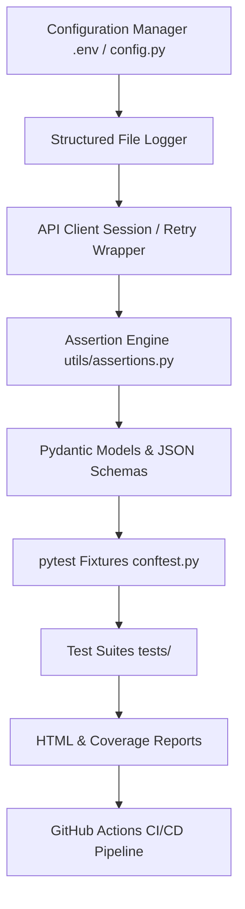
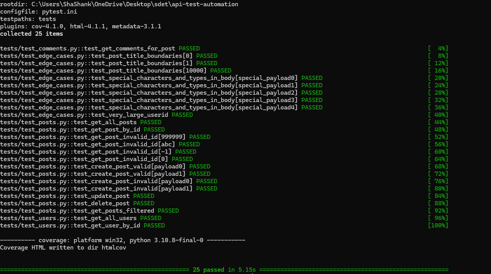
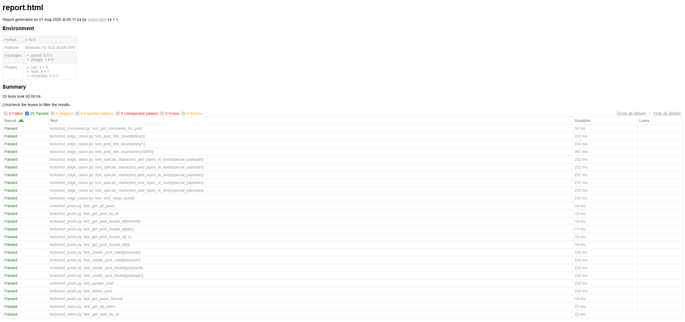
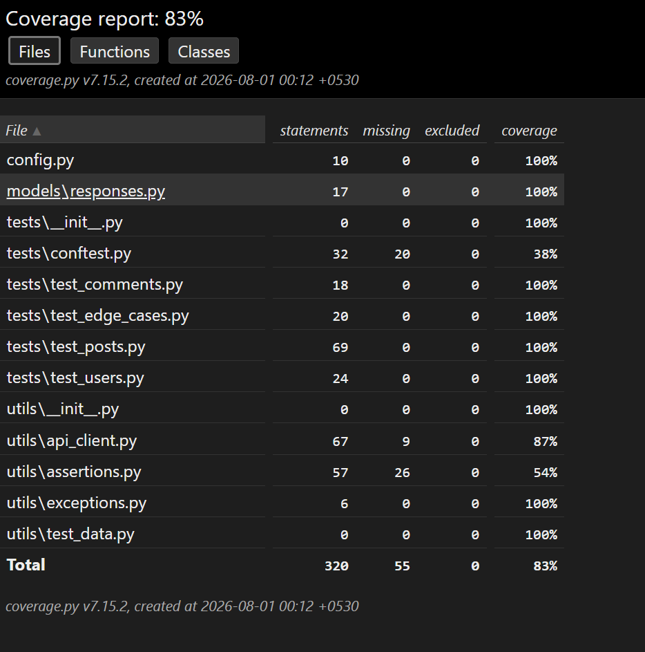
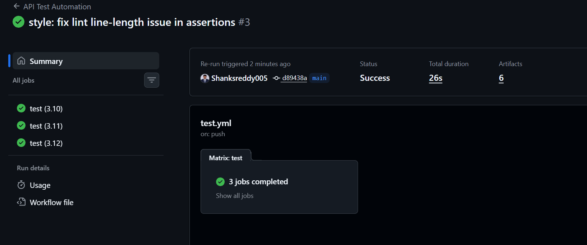

# Python API Test Automation Framework


[](https://github.com/Shanksreddy005/python-api-test-automation-framework/actions)
---

## 📋 Table of Contents
1. [Project Overview](#-project-overview)
2. [Business Value & Objective](#-business-value--objective)
3. [Framework Architecture](#-framework-architecture)
4. [Tech Stack](#-tech-stack)
5. [Repository Structure](#-repository-structure)
6. [Framework Design & Execution Flow](#-framework-design--execution-flow)
7. [Testing Strategy & Test Categories](#-testing-strategy--test-categories)
8. [Features](#-features)
9. [Assertions & Validation](#-assertions--validation)
10. [Fixtures](#-fixtures)
11. [Logging](#-logging)
12. [CI/CD (GitHub Actions)](#-cicd-github-actions)
13. [Installation](#-installation)
14. [Configuration](#-configuration)
15. [Running Tests](#-running-tests)
16. [Reporting & Code Coverage](#-reporting--code-coverage)
17. [Visual Artifacts](#-visual-artifacts)
18. [Skills Demonstrated](#-skills-demonstrated)
19. [Future Improvements](#-future-improvements)
20. [Author](#-author)

---

## 🔍 Project Overview

This project demonstrates how automated REST API testing is implemented in production environments using Python and pytest.

The framework validates API functionality, response contracts, performance, and error handling while following clean architecture principles used in modern QA Automation and SDET teams.

Although JSONPlaceholder is used as the system under test, the framework is designed to be reusable for any REST API by simply changing the configuration.

---
## Enterprise API Test Automation Framework

A production-ready REST API automation framework built with **Python**, **pytest**, and **GitHub Actions** following modern SDET best practices.
---
### Highlights

- ✅ 25 Automated API Tests
- ✅ 100% Test Pass Rate
- ✅ 83% Code Coverage
- ✅ JSON Schema Validation
- ✅ Pydantic Model Validation
- ✅ HTML Reports
- ✅ GitHub Actions CI/CD
- ✅ Connection Pooling & Retry Strategy
---

## 🎯 Business Value & Objective

In modern microservice architectures, API reliability is paramount. A single broken contract can disrupt multiple downstream services. 
This framework exists to:
*   Ensure structural contract stability (JSON Schema Validation).
*   Enforce type correctness and data integrity (Pydantic Models).
*   Verify performance SLAs (Response time testing under 2000ms).
*   Facilitate shift-left testing via a fully integrated GitHub Actions CI/CD matrix.

---

## 🏗️ Framework Architecture

The framework is decoupled into modular layers to isolate configuration, request execution, validation, and test configuration.



---
## Engineering Highlights

✔ Reusable API Client

✔ Session Pooling

✔ Retry Strategy

✔ JSON Schema Validation

✔ Pydantic Models

✔ Data-driven Tests

✔ HTML Reporting

✔ Code Coverage

✔ GitHub Actions CI/CD

✔ Custom Assertion Library

✔ Environment-based Configuration

✔ Parameterized Testing
---

## 🛠️ Tech Stack

*   **Core Language**: Python 3.10+
*   **Testing Engine**: pytest
*   **HTTP Client**: requests (equipped with Connection Pooling & urllib3 Retries)
*   **Data Validation**: Pydantic v2 (Serialization/Deserialization) & jsonschema (Draft-07 validation)
*   **Code Quality**: black, ruff, flake8, isort, pre-commit
*   **Reporting**: pytest-html & pytest-cov (Coverage XML/HTML output)
*   **CI/CD Engine**: GitHub Actions (Multi-version Python matrix)

---

## 📁 Repository Structure

```text
python-api-test-automation-framework/
├── .github/
│   └── workflows/
│       └── test.yml         # GitHub Actions pipeline with Python matrix
├── data/
│   └── test_data.json       # Parameterized datasets for data-driven testing
├── models/
│   └── responses.py         # Pydantic models for Post, User, and Comment
├── schemas/
│   ├── comment.json         # JSON Schema for comments
│   ├── post.json            # JSON Schema for posts
│   └── user.json            # JSON Schema for users
├── tests/
│   ├── conftest.py          # Pytest shared fixtures (setup/teardown)
│   ├── test_comments.py     # Verification tests for /comments endpoint
│   ├── test_edge_cases.py   # Boundary, negative, and data-type edge cases
│   ├── test_posts.py        # Functional CRUD tests for /posts endpoint
│   └── test_users.py        # Verification tests for /users endpoint
├── utils/
│   ├── api_client.py        # HTTP client wrapper with retries, pooling, and logging
│   ├── assertions.py        # Custom SDET assertion library
│   └── exceptions.py        # Custom framework-specific exceptions
├── .env.example             # Configuration variables blueprint
├── .flake8                  # Linting configuration
├── config.py                # Configuration loader using python-dotenv
├── Makefile                 # CLI execution tasks shorthand
├── pyproject.toml           # Configuration for black, isort, and ruff
├── pytest.ini               # Pytest markers and general options
├── requirements.txt         # Project requirements
└── tox.ini                  # Cross-environment automation configuration
```

---

## ⚙️ Framework Design & Execution Flow

1.  **Configuration Injection**: `config.py` queries `.env` or system variables for variables like `BASE_URL`, request `TIMEOUT`, `RETRIES`, and `LOG_LEVEL`.
2.  **HTTP Engine Instantiation**: The `APIClient` establishes a `requests.Session` (reusing TCP connections) and applies a `urllib3.util.Retry` strategy for network resilience.
3.  **Test Fixture Initialization**: Shared setup/teardown states (e.g. creating/deleting dummy resources) are executed via `tests/conftest.py`.
4.  **Data Parameterization**: Tests parse inputs from `data/test_data.json`.
5.  **Execution & Contract Validation**: Tests fire requests, log data to `logs/api.log`, check structural integrity via `jsonschema`, and validate field-level types using Pydantic.
6.  **CI/CD Pipeline**: If executed in CI, the suite runs across multiple Python environments (3.10, 3.11, 3.12) and uploads results.

---

## 🎯 Testing Strategy & Test Categories

Tests are organized using custom `pytest` markers documented in `pytest.ini`:
*   `@pytest.mark.smoke`: Critical paths testing key endpoints (e.g., retrieving posts, parsing responses).
*   `@pytest.mark.api`: General RESTful endpoint functional verification.
*   `@pytest.mark.negative`: Explicitly invalid, empty, or missing data validation to check backend robustness.
*   `@pytest.mark.boundary`: Edge conditions including extremely large numbers and maximum length payloads.

---

## ✨ Features

*   **Connection Pooling**: Uses `requests.Session()` to reuse TCP sockets, optimizing execution speed.
*   **Retry Strategy**: Gracefully handles transient 5xx server issues and rate limits (429) using `urllib3` retry backoffs.
*   **Dual Validation**: Validates overall structure (JSON Schema) and strict data types/coercions (Pydantic).
*   **Data-Driven**: Minimizes boilerplate by feeding structured JSON objects from files straight into parameterized tests.
*   **Thread-Safe Logging**: Generates readable structured logs detailing HTTP transaction cycles.

---

## 🔍 Assertions & Validation

The framework leverages a customized assertion library in `utils/assertions.py` designed to output descriptive error logs when tests fail.
*   `assert_status_code(response, expected)`
*   `assert_response_time(response, max_ms)`
*   `assert_header(response, header, expected_value)`
*   `assert_empty_response(response)`
*   `assert_json_value(response, key, expected_value)`
*   `assert_json_list_length(response, expected_length)`
*   `assert_response_schema(response, schema)`

---

## 🔌 Fixtures

Shared fixtures are isolated in `tests/conftest.py`:
1.  `api_client`: Session-scoped client initialization and teardown (closes connection pool).
2.  `test_user`: Function-scoped setup/teardown fixture that handles pre-creating a user and deleting it when the test completes.
3.  `test_post`: Function-scoped fixture executing creation and cleanup of a test post, linked to `test_user`.

---

## 📝 Logging

The framework writes structured logs to `logs/api.log` at the configured verbosity level. Example output:
```text
2026-08-01 00:10:15,312 - api_client - INFO - REQUEST | Method: POST | URL: https://jsonplaceholder.typicode.com/posts
2026-08-01 00:10:15,313 - api_client - INFO - REQUEST | Payload (JSON): {'title': 'Automated Testing Basics', 'body': '...', 'userId': 1}
2026-08-01 00:10:15,532 - api_client - INFO - RESPONSE | Status: 201 | Time: 219.00ms | URL: https://jsonplaceholder.typicode.com/posts
```

---

## 🚀 CI/CD (GitHub Actions)

The workflow defined in `.github/workflows/test.yml` executes on every `push` and `pull_request` targeting the `main` branch.
*   **Matrix Runs**: Concurrent jobs for Python 3.10, 3.11, and 3.12.
*   **Linter Checks**: Runs `black`, `isort`, `ruff`, and `flake8` to enforce standards.
*   **Caching**: Caches `pip` packages to speed up execution time.
*   **Artifact Upload**: Automatically uploads the generated HTML test report and code coverage reports.

---

## 💻 Installation

1.  **Clone the Repository**:
    ```bash
    git clone https://github.com/YOUR_USERNAME/python-api-test-automation-framework.git
    cd python-api-test-automation-framework
    ```

2.  **Install Dependencies & Hooks**:
    ```bash
    make install
    ```
    *(Alternatively: `pip install -r requirements.txt && pre-commit install`)*

---

## ⚙️ Configuration

Configure local variables by creating a `.env` file from the provided example:
```bash
cp .env.example .env
```
Default parameters in `.env`:
```env
BASE_URL=https://jsonplaceholder.typicode.com
TIMEOUT=10
RETRIES=3
LOG_LEVEL=INFO
```

---

## 🏃 Running Tests

```bash
# Run all tests
make test

# Run tests with HTML reporting and Code Coverage
make coverage

# Run linting checks
make lint

# Run automatic code formatting
make format

# Clean cache and build artifacts
make clean
```

---

## 📊 Reporting & Code Coverage

### Code Coverage
The code coverage reaches **83%** statement coverage. Executing `make coverage` produces detailed reporting:
*   **Terminal View**: High-level module summary.
*   **HTML View**: An interactive directory created at `htmlcov/index.html`.
*   **XML View**: Generates `coverage.xml` for CI parser ingestion.

### HTML Reports
`pytest-html` automatically compiles an interactive execution report saved directly to the `reports/` folder.

---

## 🖼️ Visual Artifacts

### Test Suite Execution


### Interactive HTML Test Report


### Statement Code Coverage Report


### GitHub Actions CI/CD Pipeline Matrix


---
## Project Metrics

| Metric | Value |
|---------|------:|
| Automated Tests | 25 |
| Pass Rate | 100% |
| Code Coverage | 83% |
| API Endpoints | 3 |
| Python Versions | 3.10–3.12 |
| HTML Reports | ✔ |
| CI/CD | GitHub Actions |
| Validation | JSON Schema + Pydantic |
---

## 🏆 Skills Demonstrated

*   **Production Architecture**: Decoupling configuration, connection lifecycle, and validations.
*   **Robust Network Design**: Reusing TCP pools and building smart HTTP retry structures.
*   **Defensive Contract Verification**: Combining schema-level validating with type-level checks.
*   **CI/CD Orchestration**: Advanced GitHub Actions workflow logic (caching, matrices, linting gates).
*   **Developer-Friendly Tooling**: Makefile shortcuts, unified code style configurations (`ruff`/`black`/`isort`).

---

## 🔮 Future Improvements

*   Configure concurrent test execution via `pytest-xdist`.
*   Integrate test execution reporting with platforms like Allure or ReportPortal.
*   Incorporate Locust for basic API load/throughput profiling.

---

## ✍️ Author

*   **Palagiri Shashank Reddy** – [LinkedIn](https://www.linkedin.com/in/shashank-reddy-147227260/) | [GitHub](https://github.com/Shanksreddy005)
